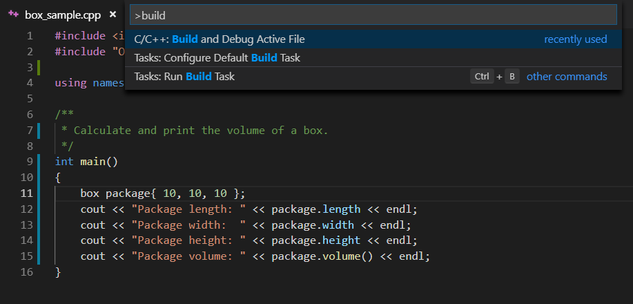
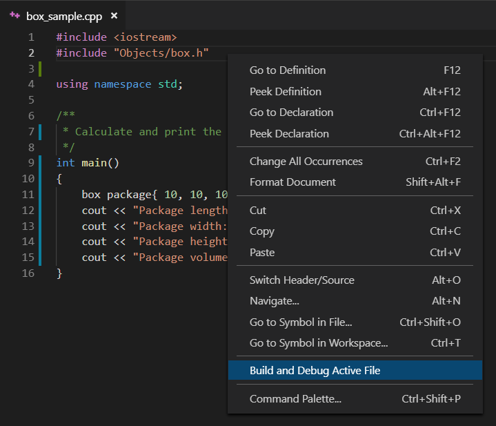

# Box Sample
This sample is a simple C++ program that computes and outputs the volume of a box.

We use this example in our blog posts to illustrate new extension features.

## Build and Debug Active File
Available as of March 2019, "Build and Debug Active File" automatically configures the build tasks and kicks off a build and debug session. There are
three ways to get started with this feature.

### Command
While editing a file in your workspace folder, you can open the command palette and select the `C/C++: Build and Debug Active File` command.
This option will generate a tasks.json file for you, build your active source file, and then launch the debugger.

### Context Menu
While editing a file in a workspace folder, you can right click in the editor field and select the "Build and Debug Active File" context menu option.
This option will generate a tasks.json file for you, build your active source file, and then launch the debugger.

### F5
Another way to begin building and debugging your active file is to execute the command by pressing <kbd>F5</kbd>. This method will configure
both a tasks.json and launch.json file for you, build your active source file, and then launch the debugger.
