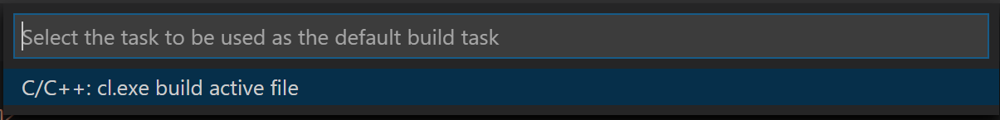

# Build your C++ file with MSVC (cl.exe) on Windows

1. Open the C++ source file that you want to build. Make sure this file is active (currently displayed) in the editor.

2. From the main menu, select **Terminal > Configure Default Build Task...**

3. Choose **C/C++: cl.exe build active file.**

    

    > Note: You must open VS Code from the **Developer Command Prompt for VS** in order for VS Code to find cl.exe on your system.

4. To run the build task, press `Ctrl+Shift+B` or from the **Terminal** main menu choose **Run Build Task.**

    > Note: Make sure your C++ source file is active (currently displayed) in the editor when running the build task, because the build task builds the active file.