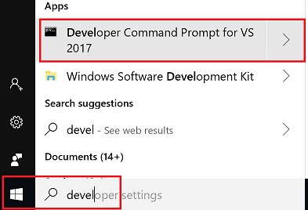

# Install a C++ compiler on Windows

If you're doing C++ development for Windows, we recommend installing the Microsoft Visual C++ (MSVC) compiler toolset. If you're targeting Linux from Windows, check out [Using C++ and Windows Subsystem for Linux (WSL) in VS Code](https://code.visualstudio.com/docs/cpp/config-wsl). Or, you could [install GCC on Windows with MinGW](https://code.visualstudio.com/docs/cpp/config-mingw).

1. To install MSVC, download **C++ Build Tools** from the Visual Studio [Downloads](https://visualstudio.microsoft.com/downloads#other) page. 

2. In the Visual Studio Installer, check the **C++ build tools** workload and select **Install**.

   >**Note**: You can use the C++ toolset from Visual Studio Build Tools along with Visual Studio Code to compile, build, and verify any C++ codebase as long as you also have a valid Visual Studio license (either Community, Pro, or Enterprise) that you are actively using to develop that C++ codebase.

3. Check your MSVC installation by typing `cl` into the **Developer Command Prompt for VS**. 

   

   >Note: To use MSVC from the command line or VS Code, you must run from a **Developer Command Prompt for VS**. An ordinary shell such as PowerShell, Bash, or the Windows command prompt does not have the necessary path environment variables set

