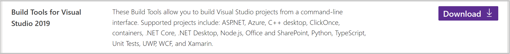
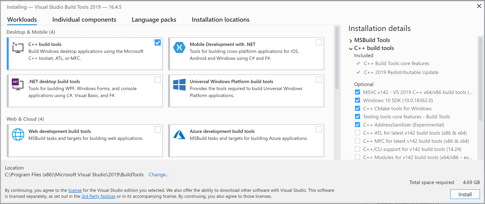
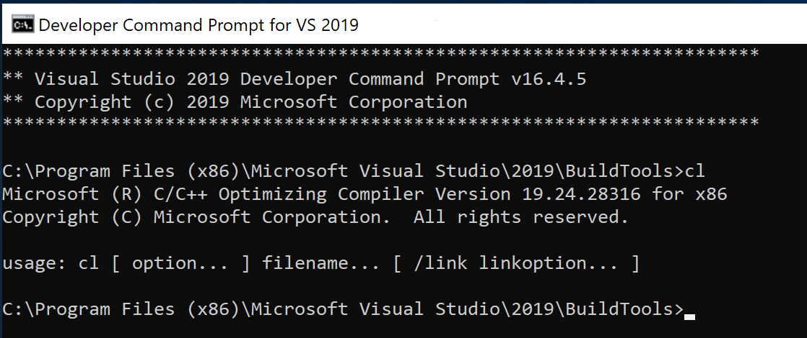

# Install a C++ compiler on Windows

If you're doing C++ development for Windows, we recommend installing the Microsoft Visual C++ (MSVC) compiler toolset. If you're targeting Linux from Windows, check out [Using C++ and Windows Subsystem for Linux (WSL) in VS Code](https://code.visualstudio.com/docs/cpp/config-wsl). Or, you could [install GCC on Windows with MinGW](https://code.visualstudio.com/docs/cpp/config-mingw).

## Installing Microsoft Visual C++ (MSVC)
   If you have a recent version of Visual Studio, open the Visual Studio Installer from the Windows Start menu and verify that the C++ workload is checked. If it's not installed, then check the box and click the **Modify** button in the installer.

   You can also install just the **C++ Build Tools**, without a full Visual Studio IDE installation. From the Visual Studio [Downloads](https://visualstudio.microsoft.com/downloads#other) page, scroll down until you see **Tools for Visual Studio** under the **All downloads** section and select the download for **Build Tools for Visual Studio**.

   

   This will launch the Visual Studio Installer, which will bring up a dialog showing the available Visual Studio Build Tools workloads. Check the **C++ build tools** workload and select **Install**.

   

>**Note**: You can use the C++ toolset from Visual Studio Build Tools along with Visual Studio Code to compile, build, and verify any C++ codebase as long as you also have a valid Visual Studio license (either Community, Pro, or Enterprise) that you are actively using to develop that C++ codebase.

## Check your Microsoft Visual C++ installation

To use MSVC from a command line or VS Code, you must run from a **Developer Command Prompt for Visual Studio**. An ordinary shell such as PowerShell, Bash, or the Windows command prompt does not have the necessary path environment variables set.

To open the Developer Command Prompt for VS, start typing 'developer' in the Windows Start menu, and you should see it appear in the list of suggestions. Click on the item to open the prompt.

You can test that you have the C++ compiler (`cl.exe`) by typing 'cl' into the Developer Command Prompt for VS.

